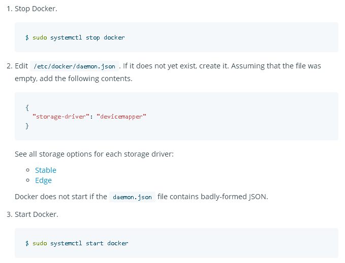

服务1. /root/solr_search/apiServer
-----------
启动命令： 
```shell
cd /root/solr_search/apiServer
sh start.sh
```


服务2. /root/solr_search/mysql
-----------
启动命令： 
```shell
cd /root/solr_search/mysql
sh start.sh
```


服务3. /root/solr_search/recommendserver
-----------
启动命令： 
```shell
cd /root/solr_search/recommendserver
sh start.sh
```


服务4. /root/solr_search/solr
-----------
启动命令： 
```shell
cd /root/solr_search/solr
sh start.sh
```


# 


nginx.conf
-----------
```
        location /search{
            proxy_pass http://127.0.0.1:9001/search;
            proxy_set_header   X-Real-IP        $remote_addr;
            proxy_set_header   X-Forwarded-For  $proxy_add_x_forwarded_for;
        }
        
        location /news{
            proxy_pass http://127.0.0.1:9002/news;
            proxy_set_header   X-Real-IP        $remote_addr;
            proxy_set_header   X-Forwarded-For  $proxy_add_x_forwarded_for;
        }
        
        location /solr{
            proxy_pass http://127.0.0.1:8983/solr;
            proxy_set_header   X-Real-IP        $remote_addr;
            proxy_set_header   X-Forwarded-For  $proxy_add_x_forwarded_for;
        }

```


南沙生产环境docker安装部署(问题解决)
----
主要的问题就是存储驱动的不兼容,可能linux的版本太老了
```
停止Docker。
$ sudo systemctl stop docker
编辑/etc/docker/daemon.json。如果它尚不存在，请创建它。假设文件为空，请添加以下内容。
{
  "storage-driver": "devicemapper"
}

启动Docker。
$ sudo systemctl start docker
```



